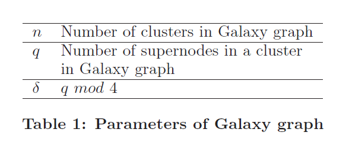
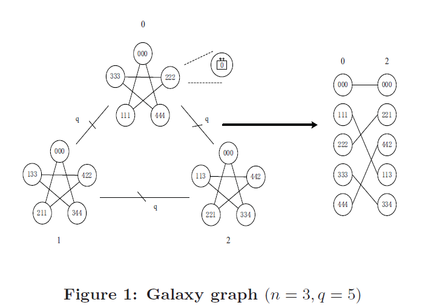

# 论文搜索浏览记录 #

## Galaxyfly: A Novel Family of Flexible-Radix Low-Diameter Topologies for Large-Scales Interconnection Networks ##

作者：Fei Lei、Dezun Dong

机构：NUDT（国防科大）

年份：2016

论文摘要：

面向百万兆级HPC集群的IN拓扑结构——Galaxyfly.
文章提出，目前IN拓扑结构的主要瓶颈来自于路由器的基数（端口数量），而路由器的端口数量又由于受到芯片资源和有限功率的限制已经很难再继续增加。目前（指这篇文章发表之时）的一些IN拓扑结构，比如：Dragonfly , HyperX, Skywalk, SlimFly等，在面对百万兆级的HPC集群时，仍有各种不足。

本文的目的是构建一种面对百万兆级HPC集群，且只需使用中高基数路由器（router with moderately high radixes）的,弹性的、小直径的IN拓扑结构,这一架构的理论知识来自于关于有限域中的代数图论，文章将这种图称为**Galaxy图**。Galaxyfly的规模和对分带宽可以灵活调整以试应不同的集群规模，并一直保证拓扑的直径不会超过2。同时针对这一拓扑结构，论文还提出了一种拥塞感知的路由算法。

当n=3.q=5时的Galaxy图如下所示：

Galaxy 图等同于一个nq图G(V,E)，它可以被分解为n个簇，每个簇内有q个节点。具体的代数理论非常复杂，这里且先不论述。

Galaxyfly是由Galaxy图和全连接图一起组成的一种拓扑结构，

## A_Cost-Efficient_Router_Architecture_for_HPC_Inter-Connection_Networks_Design_and_Implementation ##

作者：戴艺 
机构：NUDT
年份：2019

